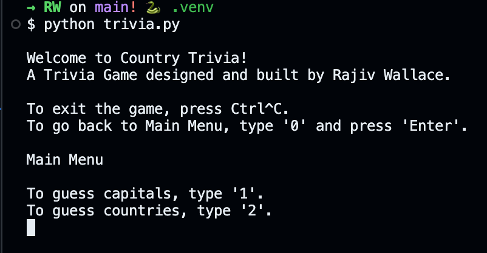

# 🗺️ Country Trivia CLI 🌍

A fun command-line interface (CLI) trivia game to test your knowledge of world capitals\!



---

## 📜 Table of Contents

- [About The Project](https://www.google.com/search?q=%23-about-the-project)
- [✨ Features](https://www.google.com/search?q=%23-features)
- [🚀 Getting Started](https://www.google.com/search?q=%23-getting-started)
  - [Prerequisites](https://www.google.com/search?q=%23prerequisites)
  - [Installation](https://www.google.com/search?q=%23installation)
- [🎮 How to Play](https://www.google.com/search?q=%23-how-to-play)
- [🧠 Data Structures & Algorithms](https://www.google.com/search?q=%23-data-structures--algorithms)
- [⚠️ Archived Project](https://www.google.com/search?q=%23%EF%B8%8F-archived-project)
- [🛠️ Known Issues](https://www.google.com/search?q=%23%EF%B8%8F-known-issues)
- [📄 License](https://www.google.com/search?q=%23-license)
- [📬 Contact](https://www.google.com/search?q=%23-contact)

---

## 📖 About The Project

**Country Trivia CLI** is a simple yet engaging trivia game built with Python. It's designed to challenge your geography skills by asking you to guess the capital of a given country or the country of a given capital. The project uses a local SQLite database to store and retrieve trivia data, making it fast and efficient.

This project was created as a fun way to practice Python fundamentals, file handling, and database interaction.

**Tech Stack:**

- **Python**
- **SQLite** for data storage
- **Pandas** for data handling

---

## ✨ Features

- **Two Game Modes:** Guess the capital city or guess the country.
- **Randomized Questions:** The trivia questions are shuffled for a new experience every time.
- **Simple CLI:** Easy-to-use and intuitive command-line interface.
- **Score Tracking:** (As seen in `player_data.py`) The structure is in place to easily add player and score tracking functionality.

---

## 🚀 Getting Started

Follow these steps to get a local copy up and running.

### Prerequisites

Make sure you have **Python 3** and **pip** installed on your system. You can check by running:

```sh
python --version
pip --version
```

### Installation

1.  **Clone the repository:**

    ```bash
    git clone https://github.com/rajivghandi767/country-trivia-cli.git
    ```

2.  **Navigate to the project directory:**

    ```bash
    cd country-trivia-cli
    ```

3.  **Install the required packages:**

    ```bash
    pip install -r requirements.txt
    ```

---

## 🎮 How to Play

1.  **Run the main script:**

    ```bash
    python trivia.py
    ```

2.  **Choose a category from the Main Menu:**

    - Type `1` to guess capitals.
    - Type `2` to guess countries.

3.  **Answer the prompts\!**

    - Type your answer and press `Enter`.
    - If you want to go back to the main menu, type `0` and press `Enter`.
    - To exit the game at any time, press `Ctrl+C`.

\<p align="center"\>
\
\</p\>

---

## 🧠 Data Structures & Algorithms

This project utilizes fundamental concepts of data structures and algorithms to function effectively.

- **Data Structure: Hash Map (Dictionary)**

  - In the `modules/player_data.py` file, the `Scoreboard` class uses a Python dictionary (`self.players`) to store `Player` objects.
  - **Why it's good:** Using a dictionary provides an efficient way to manage player data. It allows for **O(1)** or constant time complexity on average for adding new players (`add_player`), retrieving a player's score (`get_player_score`), and updating scores (`add_score`), as it uses the player's name as a unique key.

- **Algorithm: Random Sampling**

  - The `shuffle_pack` function in `modules/game_functions.py` uses `random.sample(country_data, len(country_data))`.
  - **Why it's good:** This is an efficient way to create a shuffled copy of the country data list for each new game, ensuring that the order of questions is random and unpredictable for the user.

---

## ⚠️ Archived Project

This CLI application is **no longer in active development**, and no new features will be added. The project is being continuously developed as a full-stack web application.

For the latest version, please visit the new repository:
**[github.com/rajivghandi767/country-trivia-web](https://www.google.com/search?q=https://github.com/rajivghandi767/country-trivia-web)**

---

## 🛠️ Known Issues

- Answers require exact matches, including spacing and capitalization.
- "Saint" must be fully spelled out (e.g., "Saint John's").
- Only "Pretoria" is accepted as the capital of South Africa.
- Some capitals, like Kingston, are shared by multiple territories (Jamaica & Norfolk Island), which can lead to ambiguity.

---

## 📄 License

This project is distributed under the MIT License. See the `LICENSE` file for more information.

---

## 📬 Contact

Rajiv Wallace - [@rajivghandi767](https://github.com/rajivghandi767) - rajivghandi972@gmail.com

Project Link: [https://github.com/rajivghandi767/country-trivia-cli](https://www.google.com/search?q=https://github.com/rajivghandi767/country-trivia-cli)
